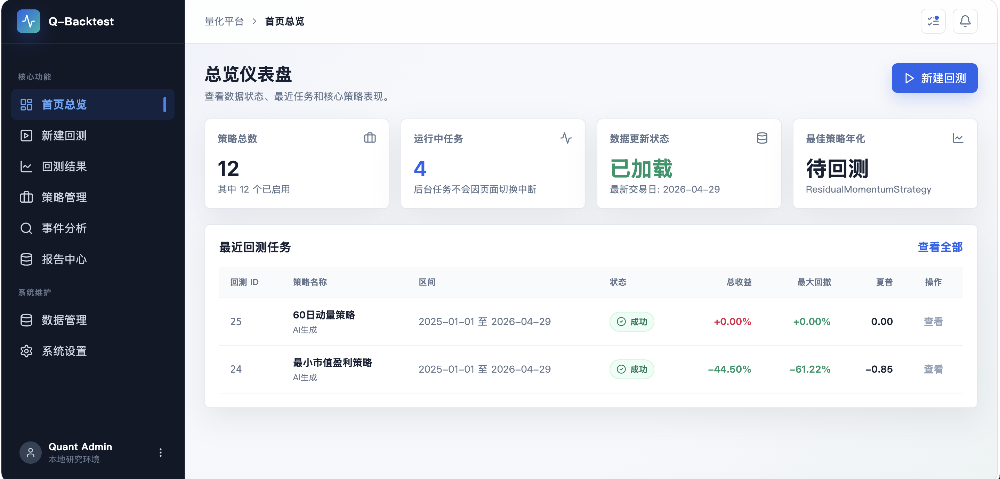

# Quant Backtest

[](https://github.com/LiuAHao/quant-backtest/stargazers)


面向本地部署的 A 股量化研究工具。下载行情数据后，可以在本机完成策略开发、回测、事件分析、因子分析、任务管理和报告查看。



## Highlights

- **策略管理**：创建、静态校验、版本化保存 Python 策略。
- **本地回测**：基于本地 parquet 行情数据运行异步回测任务。
- **事件分析**：扫描事件样本，统一统计后续窗口收益。
- **因子分析**：维护单因子定义，统一评估 IC、RankIC、分组收益、多空收益和覆盖率。
- **报告中心**：生成 JSON / HTML 报告，并在 Web 面板查看。
- **AI 辅助**：可选接入兼容 OpenAI 的接口生成策略、事件或因子草稿。
- **Agent 友好**：提供标准脚本和 API，方便外部 agent 稳定生成可识别结果。

## Quick Start

```bash
python3 -m venv .venv
source .venv/bin/activate
pip install -r requirements.txt

cd frontend
npm install
cd ..
cp .env.example .env
```

启动后端：

```bash
python3 -m uvicorn backend.main:app --reload \
  --reload-exclude 'backend/storage/strategies/*' \
  --reload-exclude 'backend/storage/event_analyses/generated/*' \
  --reload-exclude 'backend/storage/factor_analyses/generated/*' \
  --host 127.0.0.1 --port 8000
```

启动前端：

```bash
cd frontend
npm run dev
```

打开 [http://127.0.0.1:5173](http://127.0.0.1:5173)。

## Data

`data/` 不进入 git。首次使用前需要准备本地行情数据：

```bash
python3 scripts/data_download/download_by_date.py --start 20140102 --end 20260429
python3 scripts/data_download/update_extra_data.py --start 20140102 --end 20260429 --tasks daily_basic stk_limit suspend_d
python3 scripts/data_utils/validate_data.py
```

更多数据说明见 [docs/quant-data-guide.md](docs/quant-data-guide.md)。

## For Agents

外部 agent 不应直接写数据库或手工拼报告文件。请使用标准入口：

```bash
python3 scripts/agent_entry/run_standard_backtest.py --strategy-file <path> --start 2026-01-01 --end 2026-04-29
python3 scripts/agent_entry/run_standard_event_analysis.py --event-file <path> --start 2025-01-01 --end 2025-12-31 --windows 5,10,15
python3 scripts/agent_entry/run_standard_factor_analysis.py --factor-file <path> --start 2025-01-01 --end 2025-12-31 --windows 1,5,10,20
```

更完整的项目上下文、目录边界、代码规则和常用命令见 [docs/PROJECT_OVERVIEW.md](docs/PROJECT_OVERVIEW.md)。

## Docs

- [Project Overview](docs/PROJECT_OVERVIEW.md)
- [API Guide](docs/API_GUIDE.md)
- [Strategy Build Guide](docs/STRATEGY_BUILD_GUIDE.md)
- [Event Analysis Build Guide](docs/EVENT_ANALYSIS_BUILD_GUIDE.md)
- [Factor Analysis Build Guide](docs/FACTOR_ANALYSIS_BUILD_GUIDE.md)
- [Agent Standard Backtest Guide](docs/AGENT_STANDARD_BACKTEST_GUIDE.md)
- [Agent Standard Event Analysis Guide](docs/AGENT_STANDARD_EVENT_ANALYSIS_GUIDE.md)
- [Agent Standard Factor Analysis Guide](docs/AGENT_STANDARD_FACTOR_ANALYSIS_GUIDE.md)

## Test

```bash
python3 -m unittest discover -s tests -v
cd frontend && npm run build
```
